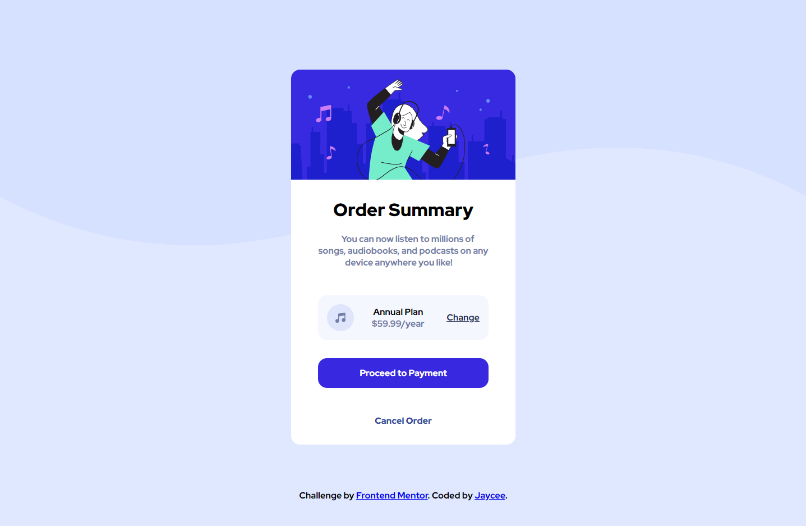

# Frontend Mentor - Order summary card solution

This is a solution to the [Order summary card challenge on Frontend Mentor](https://www.frontendmentor.io/challenges/order-summary-component-QlPmajDUj). Frontend Mentor challenges help you improve your coding skills by building realistic projects. 

## Table of contents

- [Overview](#overview)
  - [The challenge](#the-challenge)
  - [Screenshot](#screenshot)
  - [Links](#links)
- [My process](#my-process)
  - [Built with](#built-with)
  - [What I learned](#what-i-learned)
  - [Continued development](#continued-development)
  - [Useful resources](#useful-resources)
- [Author](#author)
- [Acknowledgments](#acknowledgments)

## Overview

### The challenge

Users should be able to:

- See hover states for interactive elements

### Screenshot

This is screenshot of the my solution to the challenge.
### Links

- Solution URL: [My Solution](https://github.com/simplyJC/order-summary-component-main)
- Live Site URL: [Live Site](https://simplyjc.github.io/order-summary-component-main/)

## My process

### Built with

- Semantic HTML5 markup
- FlexBox
- CSS

### What I learned

I learned how to use Grid to layout the website. Using media querid to create a responsive design

### Continued development

- Learn Flexbox and Grid for layout
- Responsive Design
- Learn to use Sass

### Useful resources

- [Example resource 1](https://www.youtube.com/watch?v=rCBYZ7xn-us&t=929s) - Amazing video tutorial by Mr Coder.
- [Example resource 2](https://github.com/ziggysauce/fem.io/tree/main/order-summary-component) - This is an amazing repository that guides me in taking this challenge.

## Author

- Website - [Jaycee Altamia](https://simplyjc.github.io/project_portfolio/)
- Frontend Mentor - [@simplyJC](https://www.frontendmentor.io/profile/simplyJC)
- Twitter - [@jcaltamia](https://www.twitter.com/jcaltamia)

## Acknowledgments

I don't have any idea how to start. Thank you to Mr. Coder for amazing tutorial and  Dan Nguyen repository. I was able to provide my solution. 

